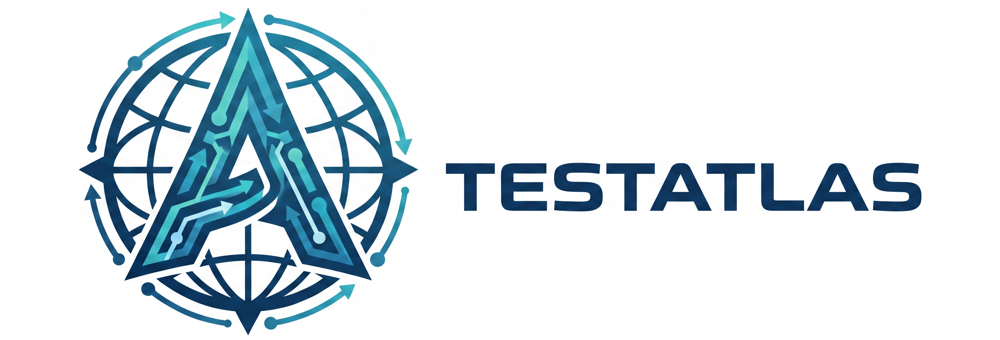

<p align="center">
  
</p>

# Installing TestAtlas

TestAtlas ships three install paths so any environment can adopt it: the canonical npm path, a POSIX shell installer for Node-light environments, and an offline `git clone` path. All three converge on the same install kernel (`scripts/lib/install-core.js`) and produce the same `.testatlas/` suite tree, `_testatlas/` workspace skeleton, and `.testatlas/.install-manifest.json` ledger inside the target repo.

## Quick choice

| Environment | Recommended path |
|-------------|-------------------|
| Modern Node devs (Claude Code, Cursor, etc.) | [`npx testatlas init`](#path-1--npx-testatlas-init-recommended) |
| Shell-first / Node bootstrap unclear | [`curl ... \| sh`](#path-2--curl--sh-posix-installer) |
| Offline / airgap / security-conscious | [`git clone`](#path-3--git-clone--node-installjs-offline) |
| Want `/atlas:*` available in **every** project, with **any** agent | [`npx testatlas init --global`](#machine-wide-install----global) |

## Machine-wide install (`--global`)

By default `testatlas init` installs into the current project (per-repo `.testatlas/` + adapter command files under that repo's `.claude/commands/`, `.cursor/rules/`, etc.). Pass `--global` to install once per machine instead — every coding agent in every project gets `/atlas:*` slash commands without a per-repo install step.

```sh
npx testatlas init --global --all-adapters
# or via the POSIX installer:
curl -fsSL https://raw.githubusercontent.com/CryptVenture/TestAtlas/main/install.sh | sh -s -- --global
```

Where files land:

| Tool | Project-local | `--global` |
|------|----------------|------------|
| Claude Code | `<repo>/.claude/commands/atlas-*.md` | `~/.claude/commands/atlas-*.md` |
| Cursor | `<repo>/.cursor/rules/atlas-*.mdc` | `~/.cursor/rules/atlas-*.mdc` |
| OpenCode | `<repo>/.opencode/commands/atlas-*.md` | `~/.config/opencode/command/atlas-*.md` |
| KiloCode | `<repo>/.kilocode/workflows/atlas-*.md` | `~/.kilocode/workflows/atlas-*.md` |
| OpenAI Codex CLI | `<repo>/.codex/prompts/atlas-*.md` | `~/.codex/prompts/atlas-*.md` |
| Google Gemini CLI | `<repo>/.gemini/commands/atlas-*.toml` | `~/.gemini/commands/atlas-*.toml` |
| Cline | `<repo>/.clinerules/workflows/atlas-*.md` | `~/.config/cline/workflows/atlas-*.md` |
| Windsurf / Cascade | `<repo>/.windsurf/workflows/atlas-*.md` | _(no global path; project-local only)_ |
| Kiro | `<repo>/.kiro/skills/atlas-*.md` | `~/.kiro/skills/atlas-*.md` |
| Continue.dev | `<repo>/.continue/prompts/atlas-*.prompt.md` | `~/.continue/prompts/atlas-*.prompt.md` |
| GitHub Copilot | `<repo>/.github/prompts/atlas-*.prompt.md` | _(no global path; settings-only)_ |
| Sourcegraph Amp | `<repo>/.agents/commands/atlas-*.md` | `~/.agents/commands/atlas-*.md` |
| Roo Code | `<repo>/.roo/rules/atlas.md` | `~/.roo/rules/atlas.md` |
| Zed | `<repo>/.rules` | _(no global path; UI-managed)_ |
| Amazon Q Developer | `<repo>/.amazonq/rules/atlas.md` | `~/.aws/amazonq/prompts/atlas.md` |
| Aider | `<repo>/CONVENTIONS.md` | `~/.config/aider/CONVENTIONS.md` |
| MCP | `<repo>/mcp-server-manifest.json` | `~/.config/testatlas/mcp-server-manifest.json` |
| Generic prompts | `<repo>/prompts/atlas-*.md` | `~/.config/testatlas/prompts/atlas-*.md` |

Notes:

- The suite tree (bootstrap, schemas, templates) is installed at `~/.testatlas/` so the bootstrap-first preamble in every command resolves consistently.
- `_testatlas/` workspace state is **never** seeded under `$HOME`. Workspace state is project-local by design — run `testatlas init` (no `--global`) inside any project to get a workspace there.
- A few tools don't auto-discover from `$HOME` (Aider, MCP). The installer prints a one-line post-install hint per affected adapter telling you the exact config line to add.
- The install manifest at `~/.testatlas/.install-manifest.json` records `"mode": "global"`, so `testatlas uninstall --target ~` reverses precisely.

## Path 1 — `npx testatlas init` (recommended)

```sh
cd /path/to/your/project
npx testatlas init
```

What this does:

1. Resolves the latest published `testatlas` package from npm.
2. Auto-detects the installed agent platform by probing for signal files (`.claude/`, `.cursor/`, `.aider.conf.yml`, `kilocode/`, `.opencode/`, MCP config), then installs only the relevant adapter(s).
3. Copies the suite tree into `./.testatlas/` and initializes `./_testatlas/` workspace skeleton.
4. Writes `./.testatlas/.install-manifest.json` (every installed file + content hash) — this drives precise uninstall.
5. Refuses to overwrite human-modified content unless `--force` is passed.

Useful flags:

| Flag | Effect |
|------|--------|
| `--all-adapters` | Install every adapter (Claude Code + OpenCode + KiloCode + Cursor + Aider + MCP + Generic). |
| `--target <dir>` | Install into `<dir>` instead of `cwd` (or `$HOME` with `--global`). |
| `--global` | Install once per machine (`$HOME` / XDG paths) instead of per-project. See [Machine-wide install](#machine-wide-install----global). |
| `--force` | Overwrite existing `.testatlas/` content (idempotency normally protects). |
| `--dry-run` | Print the install plan without writing anything. |
| `--no-update-check` | Skip the GitHub Releases version probe (UPDATE-03). |
| `--verify-signature` | Require cosign signature verification on the source tarball (UPDATE-07). |

## Path 2 — `curl … | sh` (POSIX installer)

```sh
curl -fsSL https://raw.githubusercontent.com/CryptVenture/TestAtlas/main/install.sh | sh
```

Use this when:

- Node.js is not yet installed on the target machine.
- You're scripting unattended provisioning (Docker images, CI bootstrap, dotfiles).
- You want SHA-256 verification of the installer payload (the script pins a tagged release + tarball checksum).

Behavior:

1. POSIX `/bin/sh` (works under dash, ash, bash, zsh; tested on Alpine + BusyBox).
2. Sentinel-protected against [partial-pipe attacks](./SIGNING.md#partial-pipe-protection).
3. If `node` is absent, prints actionable install instructions for the user's OS and exits non-zero (no silent failure).
4. Downloads the pinned tarball, verifies SHA-256 (and cosign sigstore bundle if `--verify-signature` is passed), extracts, then invokes `node install.js` to run the install kernel.

Override hooks (testing / mirroring):

| Env var | Purpose |
|---------|---------|
| `_TESTATLAS_TARBALL_OVERRIDE` | Use a local tarball instead of fetching from registry. |
| `TESTATLAS_SKIP_CHECKSUM=1` | Skip checksum verification (escape hatch — use only for debugging). |

## Path 3 — `git clone` + `node install.js` (offline)

```sh
git clone https://github.com/CryptVenture/TestAtlas.git
cd testatlas
node install.js /path/to/your/project
```

Use this when:

- You're operating airgapped (no npm, no public internet).
- Your security review requires source inspection before install.
- You want to vendor a specific commit SHA.

The cloned repo contains everything `npm pack` would ship — the `bin/`, `install.js`, `install.sh`, `scripts/`, `.testatlas/` template tree are all present. `node install.js <target>` invokes the same install kernel as the other paths.

## Adapter detection

The default install scans for these signals and installs only the matching adapter:

| Signal file / dir | Adapter installed |
|-------------------|-------------------|
| `.claude/` | claude-code |
| `.cursor/` or `.cursorrules` | cursor |
| `.aider.conf.yml` | aider |
| `kilocode/` | kilocode |
| `.opencode/` | opencode |
| Any `mcp.json` / MCP config | mcp |
| (none) | generic (always included) |

Pass `--all-adapters` to opt into every adapter regardless of detection.

## Idempotency contract

Re-running `init` on an already-installed target is safe:

- Files matching the recorded manifest hash are skipped.
- Files differing from the manifest are reported and skipped (require `--force` to overwrite).
- Untracked files in `.testatlas/` are left alone.
- `_testatlas/` workspace content is never touched by `init`.

## Troubleshooting

### "Node version too old"

TestAtlas requires Node ≥ 20.11.0 (see `package.json` `engines.node`). Upgrade Node, then re-run.

### Windows path-separator surprises

The install manifest stores POSIX paths (`/`-separated) even on Windows. Cross-platform path joining is handled internally; you should never see backslashes in `.testatlas/.install-manifest.json`. If you do, that's a bug — please file an issue.

### Antivirus / Defender EBUSY on Windows

The atomic-rename swap during install (and especially update) can transiently fail on Windows when antivirus or VS Code holds a file lock. The kernel retries 3 times with linear backoff (50/200/450ms). If failures persist, exclude your project directory from real-time scanning for the duration of install.

### "Refusing to overwrite modified content"

Default behavior is to NEVER silently clobber files you've changed. The install will list which files differ from the recorded manifest hash. Either revert the file, accept overwrite with `--force`, or move your changes into the workspace tree (`_testatlas/`) where the install never reaches.

### Permission denied during `npx`

If npm's prefix is set to a system path, `npx testatlas init` may fail. Either run with elevated privileges, or set a user-local prefix:

```sh
npm config set prefix ~/.local
export PATH="$HOME/.local/bin:$PATH"
```

## Next steps

- Day 1 mapping: ask your agent to run `/atlas:init`.
- See [docs/UPDATE.md](./UPDATE.md) for keeping the suite current.
- See [docs/UNINSTALL.md](./UNINSTALL.md) for clean removal.
- See [docs/SIGNING.md](./SIGNING.md) for verifying release signatures.
- See [docs/LTS.md](./LTS.md) for the support window policy.
